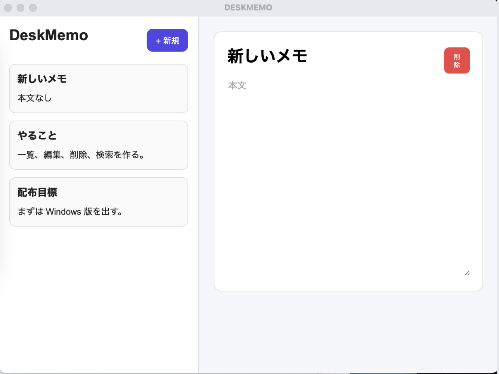

# DeskMemo

A simple and fast desktop memo application built with React, TypeScript, and Tauri.

---

## ✨ Features

* Create memo
* Edit memo
* Delete memo
* Local persistence (saved in browser storage)
* Desktop app build (macOS / Windows)

---

## 📸 Screenshot



---

## 📦 Download

You can download the desktop app from GitHub Releases:

👉 https://github.com/taba29/deskmemo/releases

* macOS: `.dmg`
* Windows: `.msi` (coming soon)

---

🍎 macOS
DESKMEMO_*.dmg をダウンロード
ダブルクリックで開く
DESKMEMO.app を Applications フォルダにドラッグ
Applications から起動

⚠️ 初回起動できない場合
macOSのセキュリティによりブロックされることがあります。
アプリを右クリック →「開く」→「開く」
またはターミナルで：
```bash
xattr -dr com.apple.quarantine /Applications/DESKMEMO.app
```

🪟 Windows
DESKMEMO_*.exe をダウンロード
ダブルクリック
インストーラーに従ってインストール
🧠 Note
macOS → .dmg を使用してください
Windows → .exe を使用してください
.tar.gz / .msi は上級者・特殊用途向けです

## 🚀 Getting Started (Development)

```bash
git clone https://github.com/taba29/deskmemo.git
cd deskmemo

npm install
npm run tauri dev
```

---

## 🛠 Tech Stack

* React
* TypeScript
* Vite
* Tauri

---

## 📁 Project Structure

```
src/
├─ components/
├─ data/
├─ types/
├─ utils/
├─ App.tsx
└─ main.tsx

src-tauri/
```

---

## 🗺 Roadmap

* [ ] Search memos
* [ ] Sort by updated date
* [ ] UI improvements
* [ ] Auto update support(lower priority)
* [ ] Cloud sync(under consideration)

---

## 📄 License

MIT License
